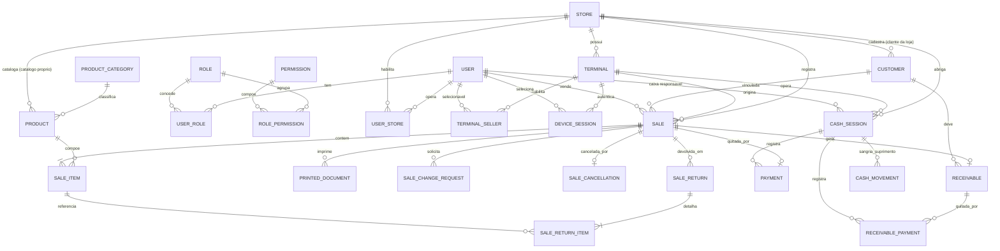
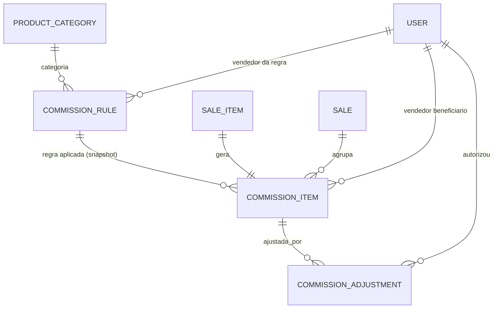
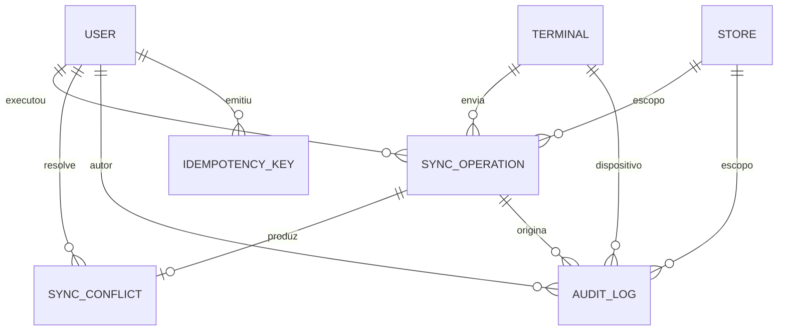

# Modelo de Dados e Diagrama ER

**Documento técnico 2**
**Projeto:** Sistema de Gestão de Vendas e Caixa — Elgin M10 Pro
**Versão:** v1.1

> **Alterações da v1.0 → v1.1** (decisões do dono, 01/09/2026)
> 1. **Catálogo por loja** — as duas lojas vendem produtos diferentes. `product` passa a ter `store_id`; `product_store_price` foi removida.
> 2. **Cliente por loja** — `customer` passa a ter `store_id` obrigatório; venda e pendência só aceitam cliente da própria loja (FK composta).
> 3. **Caixa com abertura/fechamento** — `cash_session` confirmada e `cash_movement` (sangria/suprimento) adicionada; `payment` e `receivable_payment` passam a exigir sessão aberta. Impacta a API e o fluxo offline — ver §10.
**Banco:** PostgreSQL 15+ (servidor) · SQLite (terminal)
**Documentos anteriores:** `especificacao_sistema_vendas_v2.md`, `especificacao_api_v1.md`, Diagrama de Casos de Uso (1), Modelo de Estados da Notinha (4), Modelo de Comissão (5), Fluxo de Sincronização Offline (7), Arquitetura do Aplicativo Android (8)

---

# 1. Convenções gerais

| Convenção | Definição |
|---|---|
| Nomes | `snake_case`, tabelas no singular (`sale`, `sale_item`), FK no formato `<tabela>_id` |
| Chave primária | `BIGSERIAL` no servidor (`id`) |
| Chave natural offline | `uuid UUID UNIQUE` em toda entidade que pode nascer no terminal (venda, pagamento, cliente, quitação, auditoria) — é o `operation_id` do RF36 |
| Dinheiro | `NUMERIC(12,2)` — nunca `float` |
| Percentual | `NUMERIC(5,2)` (ex.: `3.00` = 3%) |
| Quantidade | `NUMERIC(12,3)` — permite fração para óleos vendidos por litro |
| Datas | `TIMESTAMPTZ` sempre em UTC |
| `occurred_at` × `created_at` | `occurred_at` = quando o evento aconteceu no terminal (`X-Client-Timestamp`); `created_at` = quando o servidor gravou. Toda entidade offline tem os dois (RF37) |
| Exclusão | **Não existe `DELETE` físico** em entidade de negócio — apenas `is_active = false` (RF31) |
| Multi-loja | `store_id` obrigatório em toda tabela operacional; índices compostos sempre começam por `store_id` (RNF07) |
| Escopo por loja | `product` e `customer` **pertencem a uma loja**. Cadastros não cruzam lojas: o mesmo CPF pode existir duas vezes, como dois clientes distintos |
| FK composta | Onde a loja precisa bater entre duas tabelas (venda × cliente, item × produto), o vínculo é `FOREIGN KEY (x_id, store_id) REFERENCES x (id, store_id)`. O banco garante a coerência — não a aplicação |
| Snapshot | Dados que impactam o passado (preço, percentual de comissão, nome do produto) são **copiados** para a linha da venda, nunca lidos por join na regra atual (RF20) |
| Concorrência | `version INTEGER` (optimistic locking) nas entidades sujeitas a conflito de sync: `sale`, `receivable`, `customer` (13.11) |
| Enums | `VARCHAR` + `CHECK` (mapeado como `TextChoices` no Django) — evita `ALTER TYPE` em migração |

---

# 2. Mapa de entidades

| # | Domínio | Entidades | Requisitos |
|---|---|---|---|
| 1 | Identidade e organização | `store`, `user`, `role`, `permission`, `role_permission`, `user_role`, `user_store`, `terminal`, `terminal_seller`, `device_session` | RF01–RF03, RNF02, RNF07 |
| 2 | Catálogo | `product_category`, `product`, `customer` | RF04, RF05 |
| 3 | Venda | `sale`, `sale_item`, `printed_document`, `sale_change_request`, `sale_cancellation`, `sale_return`, `sale_return_item` | RF06–RF12, RF24–RF27, 13.4, 13.5, 13.13 |
| 4 | Caixa | `payment`, `cash_session`, `cash_movement` | RF09–RF12, 13.7 |
| 5 | Notinha | `receivable`, `receivable_payment` | RF13–RF16, 13.1, 13.8 |
| 6 | Comissão | `commission_rule`, `commission_item`, `commission_adjustment` | RF17–RF23, RF28, RF32, RNF03 |
| 7 | Sincronização | `sync_operation`, `sync_conflict`, `idempotency_key` | RF33–RF37, 13.9–13.11, RNF04 |
| 8 | Auditoria | `audit_log` | RF29–RF32, CA09 |

**32 tabelas.**

---

# 3. Diagrama ER

## 3.1 Núcleo: identidade, catálogo e venda



## 3.2 Comissão



## 3.3 Sincronização e auditoria



---

# 4. Dicionário de dados

## 4.1 Identidade e organização

### `store` — Loja (RF03)
| Campo | Tipo | Obrig. | Nota |
|---|---|:--:|---|
| id | BIGSERIAL PK | ✓ | |
| code | VARCHAR(10) UNIQUE | ✓ | `L1`, `L2` — usado no código de barras da venda |
| name | VARCHAR(120) | ✓ | |
| document | VARCHAR(18) | – | CNPJ |
| address | VARCHAR(255) | – | |
| is_active | BOOLEAN default true | ✓ | |
| created_at / updated_at | TIMESTAMPTZ | ✓ | |

### `user` — Usuário (RF01, RF02)
| Campo | Tipo | Obrig. | Nota |
|---|---|:--:|---|
| id | BIGSERIAL PK | ✓ | |
| username | VARCHAR(150) UNIQUE | ✓ | Dono/Gerente/Caixa fazem login; Vendedor pode não ter senha |
| password | VARCHAR(128) | – | hash Django; nulo para vendedor que só é selecionado no terminal |
| name | VARCHAR(120) | ✓ | Exibido na tela de seleção do M10 |
| email / phone | VARCHAR(120) | – | |
| is_active | BOOLEAN | ✓ | `DELETE /users/{id}/` apenas desativa (RF31) |
| last_login | TIMESTAMPTZ | – | |
| created_at / updated_at | TIMESTAMPTZ | ✓ | |

### `role` / `permission` / `role_permission` / `user_role`
| Tabela | Campos |
|---|---|
| `role` | `id`, `code` UNIQUE (`DONO`,`GERENTE`,`VENDEDOR`,`CAIXA`), `name`, `description` |
| `permission` | `id`, `code` UNIQUE (ex.: `sale.cancel`, `commission.view`), `description` |
| `role_permission` | `role_id` FK, `permission_id` FK — UNIQUE(`role_id`,`permission_id`) |
| `user_role` | `id`, `user_id` FK, `role_id` FK, `granted_by`, `granted_at` — UNIQUE(`user_id`,`role_id`). Um usuário acumula perfis (§1.6 da API) |

### `user_store` — Lojas em que o usuário atua
`id`, `user_id` FK, `store_id` FK, `is_default` BOOLEAN — UNIQUE(`user_id`,`store_id`). Alimenta `store_ids` do `POST /auth/login/`.

### `terminal` — Dispositivo M10 Pro (RF30, 13.12)
| Campo | Tipo | Obrig. | Nota |
|---|---|:--:|---|
| id | BIGSERIAL PK | ✓ | |
| store_id | FK store | ✓ | |
| device_identifier | VARCHAR(64) UNIQUE | ✓ | valor do header `X-Device-Id` (identificador físico) |
| name | VARCHAR(80) | ✓ | ex.: "Caixa 1 — Loja 2" |
| password | VARCHAR(128) | ✓ | **a senha pertence ao terminal, não ao vendedor** |
| model / android_version | VARCHAR(40) | – | `46PGM1021600`, `11` |
| is_active | BOOLEAN | ✓ | |
| last_seen_at | TIMESTAMPTZ | – | último push/pull |

### `terminal_seller` — Vendedores habilitados no terminal
`id`, `terminal_id` FK, `user_id` FK, `is_active` — UNIQUE(`terminal_id`,`user_id`). Fonte do `GET /auth/terminal/sellers/`.

### `device_session` — Sessão do terminal e do vendedor
| Campo | Tipo | Nota |
|---|---|---|
| id | BIGSERIAL PK | |
| terminal_id | FK terminal | |
| seller_id | FK user NULL | preenchido após `POST /auth/select-seller/` |
| token_jti | VARCHAR(64) UNIQUE | identificador do JWT emitido |
| kind | VARCHAR(12) CHECK (`TERMINAL`,`SESSION`) | dois níveis de identidade (§1.1 da API) |
| issued_at / expires_at / revoked_at | TIMESTAMPTZ | |
| ip | INET | |

---

## 4.2 Catálogo

### `product_category` — Categoria (RF04, RF17)
`id`, `code` UNIQUE (`PECAS`,`PNEUS`,`OLEOS`, + futuras), `name`, `is_active`, `created_at`.

### `product` — Produto (RF04) — *sem controle de estoque · catálogo próprio por loja*
| Campo | Tipo | Obrig. | Nota |
|---|---|:--:|---|
| id | BIGSERIAL PK | ✓ | |
| store_id | FK store | ✓ | **cada loja tem o próprio catálogo e o próprio preço** |
| sku | VARCHAR(40) | ✓ | UNIQUE(`store_id`,`sku`) — o mesmo SKU pode se repetir entre lojas |
| barcode | VARCHAR(64) NULL | – | UNIQUE(`store_id`,`barcode`) |
| name | VARCHAR(160) | ✓ | |
| category_id | FK product_category | ✓ | define a comissão. **Categorias continuam globais** — a regra é vendedor × categoria, não loja × categoria |
| price | NUMERIC(12,2) | ✓ | preço vigente naquela loja |
| is_active | BOOLEAN | ✓ | `DELETE` = inativação |
| created_at / updated_at | TIMESTAMPTZ | ✓ | |

> Chave alternativa `UNIQUE (id, store_id)` — existe apenas para sustentar a FK composta de `sale_item`, que impede vender na Loja 1 um produto cadastrado na Loja 2.

### `customer` — Cliente (RF05, RF14) — *pertence a uma loja*
| Campo | Tipo | Obrig. | Nota |
|---|---|:--:|---|
| id | BIGSERIAL PK | ✓ | |
| uuid | UUID UNIQUE | ✓ | pode nascer offline (`CUSTOMER_CREATE`) |
| store_id | FK store | ✓ | **escopo do cadastro** — toda listagem e busca filtra por loja |
| name | VARCHAR(160) | ✓ | |
| document | VARCHAR(18) NULL | – | UNIQUE(`store_id`,`document`) — o mesmo CPF pode existir nas duas lojas como cadastros independentes, com pendências independentes |
| phone / address / notes | VARCHAR / TEXT | – | |
| created_by_id | FK user | ✓ | |
| version | INTEGER default 1 | ✓ | detecção de conflito de sync |
| is_active | BOOLEAN | ✓ | |
| occurred_at / created_at / updated_at | TIMESTAMPTZ | ✓ | |

> Chave alternativa `UNIQUE (id, store_id)` — sustenta a FK composta de `sale` e `receivable`. Consequência operacional: **a pendência de notinha é da loja**, não do cliente como pessoa. Se o mesmo comprador dever nas duas lojas, são duas pendências separadas, e o `GET /customers/{id}/receivables/` só enxerga a loja do cadastro.

---

## 4.3 Venda

### `sale` — Venda (RF06–RF12)
| Campo | Tipo | Obrig. | Nota |
|---|---|:--:|---|
| id | BIGSERIAL PK | ✓ | `server_id` devolvido no sync |
| uuid | UUID UNIQUE | ✓ | gerado no terminal (RF07, RF36) |
| store_id | FK store | ✓ | |
| terminal_id | FK terminal | ✓ | |
| seller_id | FK user | ✓ | **um único vendedor** (RF06) — vem da sessão |
| customer_id | FK customer NULL | – | obrigatório se `payment_method = NOTINHA` |
| status | VARCHAR(24) CHECK | ✓ | `AGUARDANDO_CAIXA`, `PAGA`, `EM_ALTERACAO`, `CANCELADA`, `DEVOLVIDA_PARCIAL`, `DEVOLVIDA_TOTAL` |
| payment_method | VARCHAR(12) CHECK | ✓ | `PIX`,`DINHEIRO`,`CREDITO`,`DEBITO`,`NOTINHA` — única forma (13.7) |
| barcode | VARCHAR(40) UNIQUE | ✓ | `SALE-10482-7F3A` — usado pelo caixa (RF09) |
| gross_amount | NUMERIC(12,2) | ✓ | soma dos itens antes do desconto |
| discount_amount | NUMERIC(12,2) default 0 | ✓ | |
| total_amount | NUMERIC(12,2) | ✓ | valor efetivamente vendido (13.3) — base da comissão |
| created_offline | BOOLEAN default false | ✓ | |
| sync_operation_id | FK sync_operation NULL | – | operação que originou a venda |
| version | INTEGER default 1 | ✓ | |
| occurred_at | TIMESTAMPTZ | ✓ | data/hora no terminal — **define a regra de comissão vigente** (RF20) |
| created_at / updated_at | TIMESTAMPTZ | ✓ | |

### `sale_item` — Item da venda (RF19, 13.3)
| Campo | Tipo | Obrig. | Nota |
|---|---|:--:|---|
| id | BIGSERIAL PK | ✓ | |
| sale_id | FK sale ON DELETE RESTRICT | ✓ | |
| store_id | FK store | ✓ | denormalizado; FK composta `(product_id, store_id)` garante produto da loja da venda |
| product_id | FK product | ✓ | |
| product_name | VARCHAR(160) | ✓ | **snapshot** do nome |
| category_id | FK product_category | ✓ | **snapshot** da categoria usada na comissão |
| quantity | NUMERIC(12,3) CHECK > 0 | ✓ | |
| unit_price | NUMERIC(12,2) | ✓ | snapshot do preço |
| discount | NUMERIC(12,2) default 0 | ✓ | |
| line_total | NUMERIC(12,2) | ✓ | `quantity * unit_price - discount` |
| returned_quantity | NUMERIC(12,3) default 0 | ✓ | acumulado de devoluções parciais |

### `printed_document` — Documentos 1 e 2 (RF08, RF12, 13.13)
| Campo | Tipo | Obrig. | Nota |
|---|---|:--:|---|
| id | BIGSERIAL PK | ✓ | |
| sale_id | FK sale | ✓ | |
| doc_type | VARCHAR(6) CHECK (`DOC1`,`DOC2`) | ✓ | |
| reference | VARCHAR(40) UNIQUE | ✓ | `DOC2-10482-9K1` — exigido na devolução (13.4) |
| barcode | VARCHAR(40) | – | apenas no DOC1 |
| sequence | INTEGER default 1 | ✓ | reimpressões incrementam (auditável) |
| printed_by_id | FK user | ✓ | |
| terminal_id | FK terminal | ✓ | |
| printed_at | TIMESTAMPTZ | ✓ | |

> Regra: só pode existir `DOC2` se `sale.status = PAGA` (RF12). Validado no serviço + `CHECK` via trigger.

### `sale_change_request` — Solicitação de alteração (RF24, RF25)
| Campo | Tipo | Nota |
|---|---|---|
| id, uuid | BIGSERIAL / UUID | |
| sale_id | FK sale | |
| requested_by_id | FK user | vendedor |
| requested_changes | JSONB | schema definitivo em aberto (§7 da API) |
| reason | TEXT NOT NULL | |
| status | VARCHAR(12) CHECK (`PENDENTE`,`APROVADA`,`REJEITADA`) | |
| decided_by_id | FK user NULL | dono/gerente |
| decision_note | TEXT NULL | |
| created_at / decided_at | TIMESTAMPTZ | |

### `sale_cancellation` — Cancelamento (RF26)
`id`, `sale_id` FK **UNIQUE**, `reason` TEXT NOT NULL, `cancelled_by_id` FK user, `cancelled_at` TIMESTAMPTZ, `audit_log_id` UUID.

### `sale_return` — Devolução (RF27, 13.4, 13.5)
| Campo | Tipo | Nota |
|---|---|---|
| id, uuid | BIGSERIAL / UUID | |
| sale_id | FK sale | |
| return_type | VARCHAR(8) CHECK (`TOTAL`,`PARCIAL`) | |
| document2_reference | VARCHAR(40) FK → `printed_document.reference` | **obrigatório** — sem ele, `422` |
| reason | TEXT NOT NULL | |
| total_amount | NUMERIC(12,2) | valor devolvido |
| authorized_by_id | FK user | dono/gerente |
| created_at | TIMESTAMPTZ | |

### `sale_return_item`
`id`, `sale_return_id` FK, `sale_item_id` FK, `quantity` NUMERIC(12,3) CHECK > 0, `amount` NUMERIC(12,2) — UNIQUE(`sale_return_id`,`sale_item_id`); `SUM(quantity) ≤ sale_item.quantity`.

---

## 4.4 Caixa

### `payment` — Recebimento no caixa (RF10, RF11)
| Campo | Tipo | Obrig. | Nota |
|---|---|:--:|---|
| id | BIGSERIAL PK | ✓ | |
| uuid | UUID UNIQUE | ✓ | `CASH_PAYMENT` gerado no terminal |
| sale_id | FK sale **UNIQUE** | ✓ | um pagamento por venda — sem divisão (13.7) |
| store_id / terminal_id | FK | ✓ | |
| cashier_id | FK user | ✓ | |
| cash_session_id | FK cash_session | ✓ | **exige sessão aberta** — sem caixa aberto não há recebimento |
| payment_method | VARCHAR(12) CHECK | ✓ | `NOTINHA` não é aceito aqui |
| amount | NUMERIC(12,2) | ✓ | = `sale.total_amount` |
| created_offline | BOOLEAN | ✓ | |
| occurred_at / created_at | TIMESTAMPTZ | ✓ | |

### `cash_session` — Sessão de caixa (abertura e fechamento)
| Campo | Tipo | Obrig. | Nota |
|---|---|:--:|---|
| id | BIGSERIAL PK | ✓ | |
| uuid | UUID UNIQUE | ✓ | pode ser aberta/fechada offline |
| store_id / terminal_id | FK | ✓ | |
| cashier_id | FK user | ✓ | responsável pela sessão |
| status | VARCHAR(10) CHECK (`ABERTA`,`FECHADA`) | ✓ | |
| opening_amount | NUMERIC(12,2) | ✓ | fundo de troco informado na abertura |
| opened_at | TIMESTAMPTZ | ✓ | `occurred_at` da abertura |
| closed_at | TIMESTAMPTZ NULL | – | |
| expected_cash_amount | NUMERIC(12,2) NULL | – | calculado no fechamento: `opening + suprimentos − sangrias + recebimentos em DINHEIRO` |
| counted_cash_amount | NUMERIC(12,2) NULL | – | valor **contado** pelo caixa |
| difference | NUMERIC(12,2) **GENERATED** | – | `counted − expected` — sobra/falta |
| closing_note | TEXT | – | justificativa da diferença |
| closed_by_id | FK user NULL | – | pode ser o gerente |
| created_offline | BOOLEAN | ✓ | |
| created_at / updated_at | TIMESTAMPTZ | ✓ | |

> Só **DINHEIRO** entra na conferência física. PIX, crédito e débito são conferidos por relatório da sessão (agregação de `payment` + `receivable_payment` por `payment_method`) — não há contagem de gaveta para eles.

### `cash_movement` — Sangria e suprimento
| Campo | Tipo | Obrig. | Nota |
|---|---|:--:|---|
| id, uuid | BIGSERIAL / UUID UNIQUE | ✓ | |
| cash_session_id | FK cash_session | ✓ | |
| movement_type | VARCHAR(12) CHECK (`SUPRIMENTO`,`SANGRIA`,`AJUSTE`) | ✓ | suprimento entra, sangria sai |
| amount | NUMERIC(12,2) CHECK > 0 | ✓ | |
| reason | TEXT NOT NULL | ✓ | |
| created_by_id | FK user | ✓ | |
| authorized_by_id | FK user NULL | – | gerente, quando a política exigir |
| occurred_at / created_at | TIMESTAMPTZ | ✓ | |

---

## 4.5 Notinha e pendências

### `receivable` — Pendência do cliente (RF14, RF15)
| Campo | Tipo | Obrig. | Nota |
|---|---|:--:|---|
| id | BIGSERIAL PK | ✓ | |
| uuid | UUID UNIQUE | ✓ | |
| sale_id | FK sale **UNIQUE** | ✓ | 1:1 com a venda em notinha |
| customer_id | FK customer | ✓ | obrigatório (RF14) |
| store_id | FK store | ✓ | |
| original_amount | NUMERIC(12,2) | ✓ | |
| paid_amount | NUMERIC(12,2) default 0 | ✓ | 0 ou total (13.1) |
| pending_amount | NUMERIC(12,2) **GENERATED** | ✓ | `original_amount - paid_amount` |
| status | VARCHAR(20) CHECK | ✓ | `ABERTA`,`EM_RECEBIMENTO`,`EM_ALTERACAO`,`QUITADA`,`CANCELADA`,`BAIXADA_DEVOLUCAO`,`VENCIDA` |
| due_date | DATE NULL | – | reservado para `VENCIDA` (13.8, versão futura) |
| version | INTEGER | ✓ | |
| occurred_at / created_at / updated_at | TIMESTAMPTZ | ✓ | |

### `receivable_payment` — Quitação (RF16, 13.1)
| Campo | Tipo | Nota |
|---|---|---|
| id, uuid | BIGSERIAL / UUID UNIQUE | `RECEIVABLE_PAYMENT` |
| receivable_id | FK receivable | |
| cashier_id | FK user | |
| cash_session_id | FK cash_session | exige sessão aberta, como o pagamento de venda |
| store_id / terminal_id | FK | |
| payment_method | VARCHAR(12) CHECK (`PIX`,`DINHEIRO`,`CREDITO`,`DEBITO`) | notinha não quita notinha |
| amount | NUMERIC(12,2) | **sempre igual ao `pending_amount`** — parcial → `422` |
| occurred_at / created_at | TIMESTAMPTZ | |

> UNIQUE parcial: apenas **uma** quitação efetiva por pendência.

---

## 4.6 Comissão (RNF03 — acesso exclusivo do Dono)

### `commission_rule` — Matriz vendedor × categoria (RF17, RF20, RF32)
| Campo | Tipo | Obrig. | Nota |
|---|---|:--:|---|
| id | BIGSERIAL PK | ✓ | |
| seller_id | FK user | ✓ | |
| category_id | FK product_category | ✓ | |
| percent | NUMERIC(5,2) CHECK 0–100 | ✓ | |
| effective_from | TIMESTAMPTZ | ✓ | |
| effective_to | TIMESTAMPTZ NULL | – | `NULL` = vigente. Nova versão fecha a anterior |
| created_by_id | FK user | ✓ | sempre Dono |
| created_at | TIMESTAMPTZ | ✓ | |

> A tabela é **append-only**: alterar percentual cria nova linha e fecha `effective_to` da anterior. O histórico do `GET /commission-rules/history/` sai daqui.

### `commission_item` — Comissão congelada por item (RF19, RF20, RF21, RF22)
| Campo | Tipo | Obrig. | Nota |
|---|---|:--:|---|
| id | BIGSERIAL PK | ✓ | |
| sale_item_id | FK sale_item **UNIQUE** | ✓ | 1:1 |
| sale_id / seller_id / store_id / category_id | FK | ✓ | desnormalizado para o relatório (RF23) |
| commission_rule_id | FK commission_rule NULL | – | regra aplicada — referência, não fonte de verdade |
| base_amount | NUMERIC(12,2) | ✓ | valor líquido do item (13.3) |
| percent | NUMERIC(5,2) | ✓ | **snapshot** (RF20) |
| amount | NUMERIC(12,2) | ✓ | **snapshot** — valor corrente após ajustes |
| status | VARCHAR(12) CHECK | ✓ | `CALCULADA`,`RETIDA`,`LIBERADA`,`ESTORNADA`,`AJUSTADA` |
| calculated_at / released_at | TIMESTAMPTZ | ✓/– | |

### `commission_adjustment` — Movimentos de ajuste/estorno (RF28, RF31)
| Campo | Tipo | Nota |
|---|---|---|
| id | BIGSERIAL PK | |
| commission_item_id | FK commission_item | |
| previous_amount / new_amount | NUMERIC(12,2) | nunca sobrescreve o item — gera novo registro |
| delta | NUMERIC(12,2) GENERATED | `new_amount - previous_amount` |
| origin | VARCHAR(16) CHECK (`CANCELAMENTO`,`DEVOLUCAO`,`MANUAL`) | |
| reason | TEXT NOT NULL | |
| adjusted_by_id | FK user | Dono |
| created_at | TIMESTAMPTZ | |

---

## 4.7 Sincronização

### `sync_operation` — Operação recebida do terminal (RF35, RF36)
| Campo | Tipo | Obrig. | Nota |
|---|---|:--:|---|
| id | BIGSERIAL PK | ✓ | |
| operation_id | UUID **UNIQUE** | ✓ | deduplicação (RF36) |
| terminal_id / store_id / user_id | FK | ✓ | origem preservada (RF37) |
| op_type | VARCHAR(24) CHECK | ✓ | `SALE_CREATE`,`CASH_PAYMENT`,`CUSTOMER_CREATE`,`RECEIVABLE_PAYMENT`,`AUDIT_BATCH`,`DOCUMENT_PRINT`,`CASH_SESSION_OPEN`,`CASH_SESSION_CLOSE`,`CASH_MOVEMENT` |
| payload | JSONB | ✓ | corpo equivalente ao endpoint REST |
| status | VARCHAR(28) CHECK | ✓ | `PENDENTE_SINCRONIZACAO`,`SINCRONIZADO`,`ERRO_SINCRONIZACAO`,`CONFLITANTE` |
| entity_type / entity_id | VARCHAR(40) / BIGINT | – | `server_id` devolvido ao terminal |
| error_code / error_message | VARCHAR / TEXT | – | ex.: `PERMISSION_DENIED` (403 no lote) |
| attempts | INTEGER default 0 | ✓ | |
| occurred_at | TIMESTAMPTZ | ✓ | hora do evento no terminal, **não** do envio |
| received_at / processed_at | TIMESTAMPTZ | ✓/– | |

### `sync_conflict` — Conflito pendente de decisão (13.11)
| Campo | Tipo | Nota |
|---|---|---|
| id | UUID PK | `cf-uuid-1` |
| sync_operation_id | FK sync_operation | |
| entity_type / entity_id | VARCHAR / BIGINT | |
| server_state / local_state | JSONB | nada é sobrescrito |
| status | VARCHAR(10) CHECK (`PENDENTE`,`RESOLVIDO`) | |
| resolution | VARCHAR(24) CHECK (`MANTER_SERVIDOR`,`APLICAR_OPERACAO_LOCAL`,`MESCLAR`) NULL | |
| note | TEXT NULL | |
| resolved_by_id | FK user NULL | gerente/dono |
| created_at / resolved_at | TIMESTAMPTZ | |

### `idempotency_key` — Cache de resposta (RF36, RNF04)
`key` UUID PK, `scope` VARCHAR(80) (endpoint), `user_id` FK, `terminal_id` FK NULL, `request_hash` VARCHAR(64), `response_status` SMALLINT, `response_body` JSONB, `created_at`, `expires_at` (= `created_at + 24h`).

> Reenvio da mesma chave devolve o corpo armazenado com `X-Idempotent-Replay: true`. Job diário limpa `expires_at < now()`.

---

## 4.8 Auditoria

### `audit_log` — Registro imutável (RF29–RF32)
| Campo | Tipo | Obrig. | Nota |
|---|---|:--:|---|
| id | UUID PK | ✓ | `aud_9f31...` |
| occurred_at | TIMESTAMPTZ | ✓ | hora do evento (offline preserva a original — RF37) |
| recorded_at | TIMESTAMPTZ default now() | ✓ | hora da gravação no servidor |
| user_id | FK user NULL | – | nulo em evento de sistema |
| role | VARCHAR(12) | ✓ | perfil **no momento** do evento (snapshot) |
| store_id | FK store NULL | – | |
| terminal_id | FK terminal NULL | – | `device_id` (RF30) |
| action | VARCHAR(40) | ✓ | `VENDA_CRIADA`, `ALTERACAO_COMISSAO`, `CANCELAMENTO`, `LOGIN`… |
| entity / entity_id | VARCHAR(40) / VARCHAR(40) | ✓ | |
| before / after | JSONB | – | dados anteriores e novos |
| reason | TEXT NULL | – | obrigatório em cancelamento/devolução |
| ip | INET NULL | – | |
| operation_id | UUID NULL | – | liga à `sync_operation` |
| origin | VARCHAR(8) CHECK (`ONLINE`,`OFFLINE`) | ✓ | |
| is_commission_related | BOOLEAN default false | ✓ | filtro que **esconde o evento do Gerente** (RF18) |

---

# 5. Regras de integridade no banco

Constraints que não devem ficar apenas na aplicação:

```sql
-- RF14 · notinha exige cliente
ALTER TABLE sale ADD CONSTRAINT ck_sale_notinha_customer
  CHECK (payment_method <> 'NOTINHA' OR customer_id IS NOT NULL);

-- Escopo por loja · cliente e produto não cruzam lojas (FK composta)
ALTER TABLE customer ADD CONSTRAINT uq_customer_id_store UNIQUE (id, store_id);
ALTER TABLE product  ADD CONSTRAINT uq_product_id_store  UNIQUE (id, store_id);

ALTER TABLE sale ADD CONSTRAINT fk_sale_customer_same_store
  FOREIGN KEY (customer_id, store_id) REFERENCES customer (id, store_id);

ALTER TABLE sale_item ADD CONSTRAINT fk_sale_item_product_same_store
  FOREIGN KEY (product_id, store_id) REFERENCES product (id, store_id);

ALTER TABLE receivable ADD CONSTRAINT fk_receivable_customer_same_store
  FOREIGN KEY (customer_id, store_id) REFERENCES customer (id, store_id);

-- Cadastros com escopo de loja
CREATE UNIQUE INDEX uq_product_store_sku     ON product (store_id, sku);
CREATE UNIQUE INDEX uq_product_store_barcode ON product (store_id, barcode) WHERE barcode IS NOT NULL;
CREATE UNIQUE INDEX uq_customer_store_doc    ON customer (store_id, document) WHERE document IS NOT NULL;

-- Caixa · uma única sessão aberta por terminal
CREATE UNIQUE INDEX uq_cash_session_open_terminal
  ON cash_session (terminal_id) WHERE status = 'ABERTA';

-- Caixa · diferença de fechamento é derivada, nunca digitada
ALTER TABLE cash_session ADD COLUMN difference NUMERIC(12,2)
  GENERATED ALWAYS AS (counted_cash_amount - expected_cash_amount) STORED;

-- Caixa · recebimento exige sessão aberta e do mesmo caixa (trigger)
--   valida: cash_session.status = 'ABERTA'
--        AND cash_session.store_id = payment.store_id
--        AND cash_session.cashier_id = payment.cashier_id

-- 13.7 · sem pagamento dividido (1 pagamento por venda)
ALTER TABLE payment ADD CONSTRAINT uq_payment_sale UNIQUE (sale_id);

-- 13.1 · uma única quitação efetiva por pendência
CREATE UNIQUE INDEX uq_receivable_payment_effective
  ON receivable_payment (receivable_id) WHERE voided_at IS NULL;

-- RF15 · saldo derivado, nunca digitado
ALTER TABLE receivable ADD COLUMN pending_amount NUMERIC(12,2)
  GENERATED ALWAYS AS (original_amount - paid_amount) STORED;

-- RF20 · vigências de comissão não podem se sobrepor
CREATE EXTENSION IF NOT EXISTS btree_gist;
ALTER TABLE commission_rule ADD CONSTRAINT ex_commission_rule_no_overlap
  EXCLUDE USING gist (
    seller_id   WITH =,
    category_id WITH =,
    tstzrange(effective_from, effective_to, '[)') WITH &&
  );

-- RF19 · comissão é 1:1 com o item
ALTER TABLE commission_item ADD CONSTRAINT uq_commission_sale_item UNIQUE (sale_item_id);

-- RF36 · deduplicação da sincronização
ALTER TABLE sync_operation ADD CONSTRAINT uq_sync_operation_id UNIQUE (operation_id);

-- 13.4 · devolução exige documento 2 válido
ALTER TABLE printed_document ADD CONSTRAINT uq_printed_document_ref UNIQUE (reference);
ALTER TABLE sale_return ADD CONSTRAINT fk_return_doc2
  FOREIGN KEY (document2_reference) REFERENCES printed_document(reference);

-- RF31 · auditoria imutável
CREATE OR REPLACE FUNCTION fn_audit_immutable() RETURNS trigger AS $$
BEGIN
  RAISE EXCEPTION 'audit_log é imutável (RF31)';
END; $$ LANGUAGE plpgsql;

CREATE TRIGGER trg_audit_no_update BEFORE UPDATE OR DELETE ON audit_log
  FOR EACH ROW EXECUTE FUNCTION fn_audit_immutable();

REVOKE UPDATE, DELETE ON audit_log FROM app_user;
```

Regras que permanecem em serviço de domínio (transação única):

| Regra | Efeito |
|---|---|
| `POST /cash/payments/` | `payment` + `sale.status = PAGA` + `commission_item.status → LIBERADA` + `audit_log` |
| `POST /receivables/{id}/payments/` | `receivable_payment` + `receivable.status = QUITADA` + `commission_item RETIDA → LIBERADA` + `audit_log` |
| `POST /sales/{id}/cancel/` | `sale_cancellation` + `sale.status = CANCELADA` + `commission_adjustment` (estorno total) + baixa da `receivable` + `audit_log` |
| `POST /sales/{id}/return/` | `sale_return` + `sale_return_item` + `sale_item.returned_quantity` + `commission_adjustment` proporcional + `audit_log` |
| Criação de venda | `sale` + `sale_item` + `commission_item` (percentual buscado por `occurred_at`) + `printed_document DOC1` + `audit_log` — tudo em uma transação |
| Abertura de caixa | `cash_session` (`ABERTA`, `opening_amount`) + `audit_log`. Falha se já houver sessão aberta no terminal |
| Fechamento de caixa | calcula `expected_cash_amount`, grava `counted_cash_amount`, fecha a sessão + `audit_log` com a diferença. Divergência **não bloqueia** o fechamento — exige `closing_note` |

---

# 6. Índices

| Tabela | Índice | Motivo |
|---|---|---|
| `sale` | `UNIQUE (barcode)` | RF09 / RNF05 — leitura no caixa deve ser instantânea |
| `sale` | `(store_id, status, occurred_at DESC)` | fila do caixa e listagens |
| `sale` | `(seller_id, occurred_at)` | "vendedor vê apenas as próprias" |
| `sale` | `UNIQUE (uuid)` | reconciliação offline |
| `sale_item` | `(sale_id)`, `(product_id)` | |
| `commission_item` | `(seller_id, category_id, calculated_at)` | relatório RF23 |
| `commission_item` | `(sale_id)`, `(status)` | liberação/estorno |
| `commission_rule` | `(seller_id, category_id, effective_from DESC)` | busca da regra vigente |
| `receivable` | `(customer_id, status)`, `(store_id, status)` | RF15 |
| `payment` | `(store_id, occurred_at)`, `(cash_session_id, payment_method)` | fechamento de caixa por forma de pagamento |
| `cash_session` | `UNIQUE (terminal_id) WHERE status='ABERTA'`, `(store_id, opened_at DESC)` | sessão única e histórico |
| `cash_movement` | `(cash_session_id, occurred_at)` | apuração de sangria/suprimento |
| `sync_operation` | `UNIQUE (operation_id)`, `(terminal_id, status, occurred_at)` | fila e reenvio |
| `sync_conflict` | `(status, created_at)` | `GET /sync/conflicts/` |
| `audit_log` | `(entity, entity_id)`, `(store_id, occurred_at DESC)`, `(user_id, occurred_at)`, `(action)` | RF29 |
| `audit_log` | `(is_commission_related)` parcial | corta eventos de comissão para o Gerente |
| `customer` | `GIN (name gin_trgm_ops)`, `(store_id, is_active)`, `UNIQUE (store_id, document)` | busca `?q=` sempre dentro da loja |
| `product` | `GIN (name gin_trgm_ops)`, `(store_id, category_id, is_active)`, `UNIQUE (store_id, sku)`, `UNIQUE (store_id, barcode)` | catálogo por loja |
| `idempotency_key` | `(expires_at)` | limpeza |

Particionamento: `audit_log` e `sync_operation` por mês (`RANGE` em `occurred_at`) quando o volume justificar. Não é necessário na V1 com duas lojas.

---

# 7. Banco local do terminal (SQLite — RF34)

Espelho reduzido, sem nada confidencial. **Nenhum percentual ou valor de comissão é persistido no dispositivo** (RF18 · RNF03).

| Tabela local | Origem | Diferenças em relação ao servidor | Retenção |
|---|---|---|---|
| `product` | pull | **apenas o catálogo da loja do terminal**; sem `is_active=false` | permanente |
| `product_category` | pull | global | permanente |
| `customer` | pull + local | **apenas clientes da loja**; `uuid` como chave; `server_id` NULL até sincronizar | permanente |
| `cash_session` | local + pull | sessão do terminal; abertura/fechamento funcionam offline | 90 dias |
| `cash_movement` | local | sangria e suprimento entram na fila como operação | 90 dias |
| `sale` | local + pull | PK = `uuid`; `server_id INTEGER NULL`; `sync_status` | 90 dias |
| `sale_item` | local | **sem** `commission_percent` / `commission_amount` | 90 dias |
| `payment` | local | | 90 dias |
| `receivable` | local + pull | somente em aberto | enquanto aberta |
| `sync_operation` | local | `operation_id`, `type`, `payload`, `occurred_at`, `status`, `attempts`, `last_error` | até `SINCRONIZADO` |
| `audit_log` | local | preserva `occurred_at`, terminal, usuário e perfil | até sincronizar |
| `device_session` | servidor | token em `secure_storage`, fora do SQLite | sessão |

Regras do espelho:
- `sync_status` local: `PENDENTE_SINCRONIZACAO` → `SINCRONIZADO` (sai da fila) · `ERRO_SINCRONIZACAO` / `CONFLITANTE` permanecem visíveis ao operador.
- Toda escrita local é uma transação única: entidade + itens + `audit_log` + `sync_operation` (offline-first, doc. 8 §B).
- Cache enxuto por loja — 2 GB de RAM / 64 GB (13.12): com catálogo e clientes segmentados por loja, o pull fica naturalmente menor, e o terminal não precisa filtrar nada em tempo de consulta.
- A sessão de caixa aberta offline recebe `uuid` local; o `payment` criado na mesma janela referencia esse `uuid`, não o `id` do servidor. O push envia a abertura antes dos pagamentos, na ordem de ocorrência.

---

# 8. Rastreabilidade requisito → tabela

| RF | Onde vive |
|---|---|
| RF01, RF02 | `user`, `role`, `permission`, `user_role`, `role_permission`, `terminal`, `device_session` |
| RF03 | `store`, `user_store` |
| RF04 | `product` (por loja), `product_category` (global) |
| RF05 | `customer` (por loja) |
| RF06–RF07 | `sale` (`seller_id` único, `uuid`, `barcode`) |
| RF08, RF12, 13.13 | `printed_document` |
| RF09 | `sale.barcode` + índice único |
| RF10, RF11 | `payment`, `cash_session`, `cash_movement` |
| RF13–RF15 | `sale.payment_method='NOTINHA'`, `receivable` |
| RF16, 13.1 | `receivable_payment` |
| RF17 | `commission_rule` |
| RF18, RNF03 | serialização condicional + `audit_log.is_commission_related` |
| RF19–RF22 | `commission_item` (snapshot + status) |
| RF23 | `commission_item` desnormalizado + índices |
| RF24, RF25 | `sale_change_request` |
| RF26 | `sale_cancellation` |
| RF27, 13.4, 13.5 | `sale_return`, `sale_return_item`, FK ao `DOC2` |
| RF28 | `commission_adjustment` |
| RF29–RF32 | `audit_log` + trigger de imutabilidade |
| RF33–RF35 | `sync_operation` + SQLite local |
| RF36, RNF04 | `operation_id` UNIQUE + `idempotency_key` |
| RF37 | `audit_log.occurred_at` / `origin` / `terminal_id` |
| 13.11 | `sync_conflict` |

---

# 9. Decisões tomadas e pontos ainda abertos

## 9.1 Decididas (01/09/2026)

| Decisão | Consequência no modelo |
|---|---|
| Lojas vendem produtos diferentes | `product.store_id` obrigatório; `product_store_price` removida; SKU e código de barras únicos **por loja**; o catálogo local do terminal é o da sua loja |
| Cliente pertence a uma loja | `customer.store_id` obrigatório; CPF único por loja; FK composta impede notinha com cliente de outra loja; pendências não se somam entre lojas |
| Caixa com abertura/fechamento | `cash_session` + `cash_movement`; `payment` e `receivable_payment` exigem sessão aberta; conferência física só de dinheiro |

## 9.2 Ainda abertos

1. **Sangria exige autorização do gerente?** O campo `authorized_by_id` já existe em `cash_movement`, mas nulo. Se a política exigir, vira `NOT NULL` para `SANGRIA` e entra na lista de operações que exigem servidor (13.9).
2. **Divergência de fechamento bloqueia?** Modelado como **não bloqueante** (fecha com `closing_note`). Se a regra for travar acima de um limite, é validação de serviço, não de schema.
3. **Sessão de caixa offline.** Modelado como permitido — o caixa não pode parar sem internet. Isso **contradiz o documento técnico 7**, que não lista abertura/fechamento entre as operações offline; precisa ser incorporado lá.
4. **Cliente com cadastro nas duas lojas.** Hoje são dois registros independentes. Se o dono quiser ver a exposição total de um comprador, isso vira um relatório consolidado por `document`, não uma mudança de modelo.
5. **`requested_changes`.** Permanece `JSONB` genérico até a definição do schema (item em aberto na especificação da API).
6. **Validação do `X-Device-Id`.** O modelo já suporta (`terminal.device_identifier` UNIQUE); falta decidir se o backend rejeita terminal não cadastrado.
7. **`VENCIDA`.** O campo `due_date` está previsto mas não é usado na V1 (13.8).
8. **Comissão parcial de notinha.** O modelo suporta as duas alternativas: `commission_item.status` e `commission_adjustment` já permitem liberação proporcional caso a regra mude. Na V1 vale `RETIDA → LIBERADA` só na quitação integral.

---

# 10. Impacto nos documentos já produzidos

As três decisões da v1.1 tornam desatualizados trechos de documentos anteriores. Correções necessárias:

| Documento | O que muda |
|---|---|
| `especificacao_sistema_vendas_v2.md` | §12: acrescentar "Catálogo — por loja" e "Cliente — por loja". §13: nova subseção de abertura/fechamento de caixa (hoje inexistente). §7.3: `CashRegister`/`CashSession` deixam de ser hipótese |
| `especificacao_api_v1.md` | `GET /products/` e `GET /customers/` passam a filtrar obrigatoriamente por `X-Store-Id`. Novas rotas: `POST /cash/sessions/`, `POST /cash/sessions/{id}/close/`, `GET /cash/sessions/current/`, `POST /cash/sessions/{id}/movements/`. `POST /cash/payments/` passa a exigir sessão aberta (`409 CONFLICT` se não houver) |
| Documento técnico 7 — Sincronização | Bloco C ("permitido offline") ganha abertura, fechamento e movimento de caixa. Novos tipos de operação: `CASH_SESSION_OPEN`, `CASH_SESSION_CLOSE`, `CASH_MOVEMENT`. Ordem no push importa: a abertura vai antes dos pagamentos |
| Documento técnico 8 — App Android | Módulo `cash` ganha telas de abertura e fechamento; SQLite local ganha `cash_session` e `cash_movement` |
| Diagrama de Casos de Uso | Novos casos: "Abrir caixa", "Fechar caixa (conferência)", "Registrar sangria/suprimento" — ator Caixa, com participação do Gerente na autorização |

# 11. Próximo documento

Com a modelagem fechada, o passo seguinte da lista do §16 da especificação é o **Modelo de estados da venda** (documento técnico 3) — hoje o único diagrama de estados ainda não formalizado, e que precisa detalhar as transições de `EM_ALTERACAO`.
